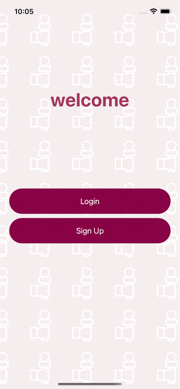
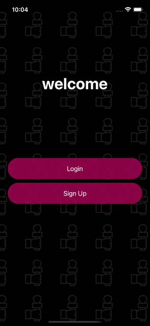
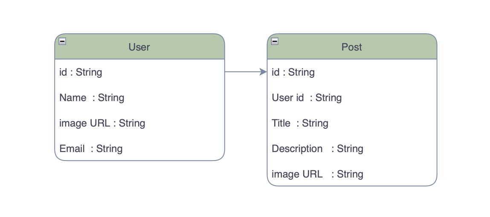
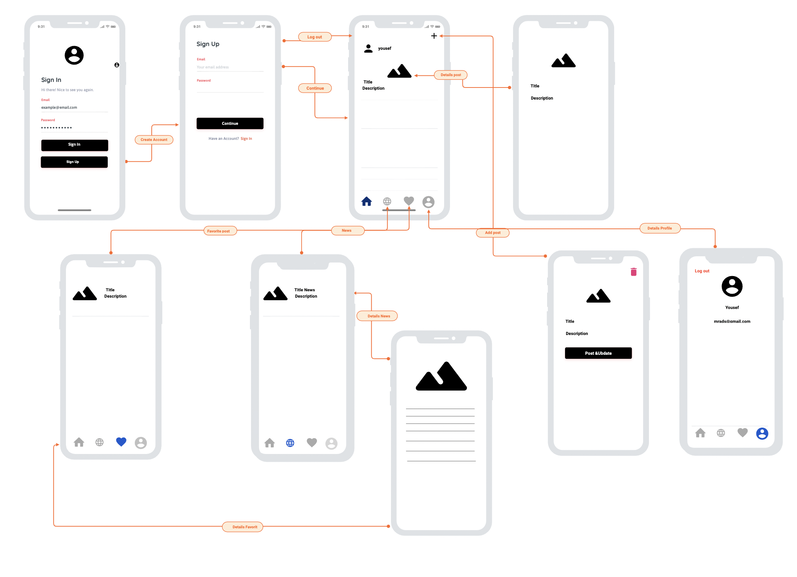

# News app

## Description 

- news app 

## Dark Mode  and light Mode 

## ERD

## User Stories 
- User can create a login
- User can log in
- User can add post
- User can update post
- User can delete post 
- User can read post other account 
- User can read news
- User can update Profile 

## FrameWork

- UIKit
- Firebase
- IQKeyboardManagerSwift
- WebKit

## API

- I used the API from this site https://newsapi.org/

## WireFrame

